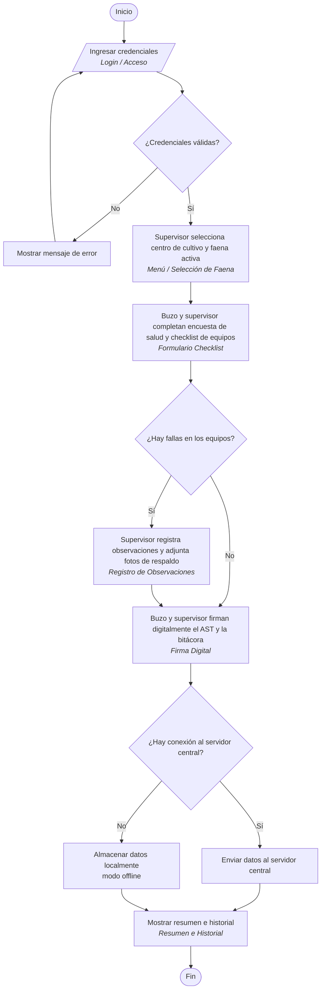

# Diagrama de flujo principal – MVP AquaChile

```mermaid
flowchart TD
    A([Inicio]) --> B[/"Ingresar credenciales<br/><i>Login / Acceso</i>"/]
    B --> C{¿Credenciales válidas?}
    C -- No --> D[Mostrar mensaje de error]
    D --> B
    C -- Sí --> E["Supervisor selecciona centro de cultivo y faena activa<br/><i>Menú / Selección de Faena</i>"]
    E --> F["Buzo y supervisor completan encuesta de salud y checklist de equipos<br/><i>Formulario Checklist</i>"]
    F --> G{¿Hay fallas en los equipos?}
    G -- Sí --> H["Supervisor registra observaciones y adjunta fotos de respaldo<br/><i>Registro de Observaciones</i>"]
    G -- No --> I
    H --> I["Buzo y supervisor firman digitalmente el AST y la bitácora<br/><i>Firma Digital</i>"]
    I --> J{¿Hay conexión al servidor central?}
    J -- Sí --> K[Enviar datos al servidor central]
    J -- No --> L[Almacenar datos localmente<br/>modo offline]
    K --> M["Mostrar resumen e historial<br/><i>Resumen e Historial</i>"]
    L --> M
    M --> N([Fin])
```
